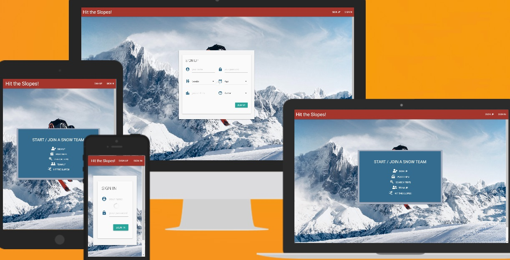
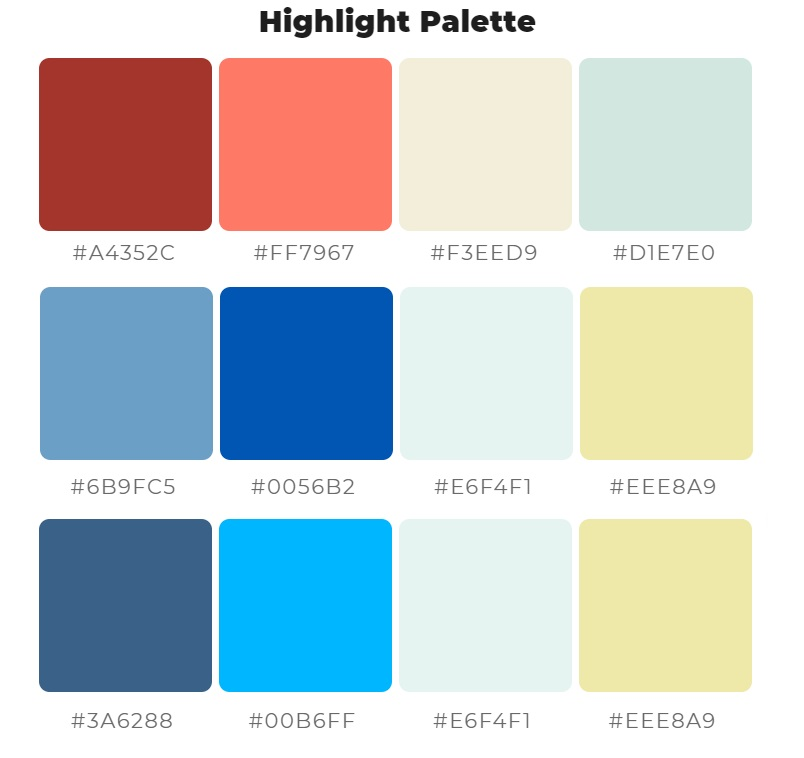
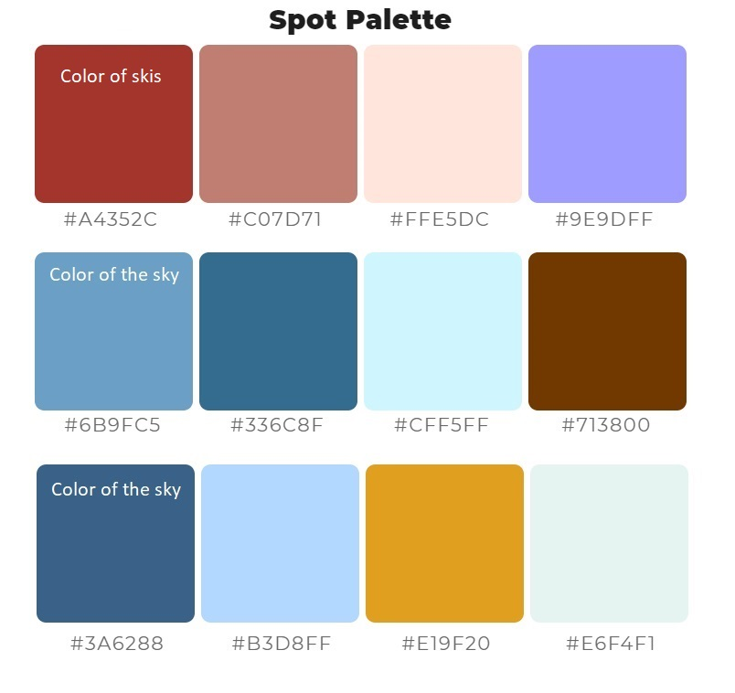

# Hit the Slopes!
## Let's Team Up & Hit the Slopes!

#### Python & Data Centric Project:
Website for people interested in skiing/snowboarding for planning their trips and meeting other visitors with similar interests. The website is be built using Flask-Python & MongoDB.

[Hit the Slopes - Heroku link](https://hit-the-slopes.herokuapp.com/)

************************************************************

## Table of Contents
1. [**UX**](#ux)
    - [**Goals**](#goals)
    - [**Strategy**](#strategy)
    - [**Scope**](#scope)
    - [**Structure**](#structure)
    - [**Skeleton**](#skeleton)
    - [**Surface**](#surface)

2. [**Features**](#features)
    - [**Existing Features**](#existing-features)
    - [**Features to be Implemented**](#features-to-be-implemented)

3. [**Technologies used**](#technologies-used)

4. [**Testing**](#testing)

5. [**Deployment**](#deployment)
    - [**How to run this project locally**](#how-to-run-this-project-locally)

6. [**Credits**](#credits)
    - [**Content**](#content)
    - [**Images**](#images)
    - [**Code**](#code)
    - [**Acknowledgments**](#acknowledgments)

7. [**Disclaimer**](#disclaimer)

************************************************************

## UX

### GOALS

What is the main goal of this site? 
- To provide easy to use, well-structured application to plan skiing holidays and team up with other people (based on common features, interests: age, family+kids, skiers or snowboarders, solo visitors).
The website will be built to cover only one country, with a possibility of scalability and adding more countries. 

Organizational Goals:
- Create a simple, easy to use website, where people can look for upcoming skiing trips of other people going to same locations on same dates. Based on similar features/interests (age, family-kids, solo, etc.). The website can be used by managers of skiing areas to add their areas to the DB, and attract visitors, as well as potentially promote events, promotions, etc. 

User Goals:
* Users: 
    - Effortlessly create a trip indicating dates, location, and who goes (number of people, age, etc).
    - Easily add a skiing area if not already in DB
    - Find trips and see details, and decide if a user is interested to contact other visitors going to same place on same dates
    - Vote for locations (optional)
    - Communicate with other users (feature to be added in the future)

* Ski location managers:
    - Add location to DB with relevant info
    - Provide info about promotions, possibly events

##### back to [top](#table-of-contents)

* Developer's goals:
    - Learn & practice data-driven full stack development, using HTML, CSS, & Javascript/JQuery, Flask-Python, MongoDb. 
    - Potentially monetize the platform/app by offering advertising options to skiing locations’ managers, restaurants, spas, other businesses in the skiing areas, skiing equipment and outfit brands
    - Extra potential to offer advertising to brands, like Red Bull or Audi who have constant advertising and events sponsorship on skiing locations

* User Interface:
    - Visually simple and easy to navigate
    - Not too crowded or too colorful
    - Clear objectives, instructions, reactions or prompts where needed

### STRATEGY

Create a website where people can look for other people to team up for skiing holidays. For example, a family (age between 30-35) going to ski with one kid (age 6), would be interested to meet similar people, parents of similar age, with a kid of similar age, if both families going to the same location on same dates.  
Reasoning: people can find people (from same or different countries) with similar interests, communicate before the trip, and then have good time during the trip at the location. 

##### back to [top](#table-of-contents)

### SCOPE 

User Stories:
* Visitors:
    - I want to find other people with similar interests to meet them during my skiing holidays
    - I want to easily add details of my trip to the DB
    - I want to be able to check for already added trips and see if I’m interested to connect to other people
    - I would like to contact other users
    - I want to add locations if not yet in DB
    - I want to see all trips for the next two months to a chosen location, and see if I’d plan my trip together with some other people

* Locations’ manager:
    - I want to add my location to the DB so users don’t have to do that
    - I want to provide most important info about my location
    - I want to provide correct links to my website
    - I want to advertise my location and promote upcoming events

### STRUCTURE 

- The main screen will have a background image and a slogan: "Let’s Team Up & Hit the Slopes", plus two buttons: Sign Up & Sign In

- Sing Up screen: 
    - Username, Password, Re-enter password, Choose an avatar
    - Navbar, with the website Name/Logo, Menu: Home, SignUp, SignIn
    - INFO button to open footer modal with copyright info

- Sing In screen: 
    - Username, Password
    - Navbar, with the website Name/Logo, Menu: Home, SignUp, SignIn
    - INFO button to open footer modal with copyright info

- Trips screen: 
    - List of trips with dates, location, user info.
    - Navbar, with the website Name/Logo, Menu: Home, Trips, Add Trip, Locations, Add Location
    - INFO button to open footer modal with copyright info
    - Each trip thumbnail has a user icon, which (onhover or onclick) shows info about a user: age, m/f, from (e.g. Prague), ski/snowboard preference, and option to contact
    - Sidebar with Top locations, and search options (optional)

##### back to [top](#table-of-contents)

- Locations screen: 
    - List of locations with dates, location, user info
    - Navbar, with the website Name/Logo, Menu: Home, Trips, Add Trip, Locations, Add Location
    - INFO button to open footer modal with copyright info
    - Sidebar with upcoming trips, and search options (optional)

- Add Location screen: 
    - Fields to fill in:
        - Name
        - Description
        - Website link
        - Location map link
        - Conditions (spring/autumn skiing, night skiing, glacier or not)
        - Picture upload option
        - Additional info 
    - Navbar, with the website Name/Logo, Menu: Home, Trips, Add Trip, Locations, Add Location
    - INFO button to open footer modal with copyright info

- Add Trip screen: 
    - Fields to fill in:
        - Location name
        - Dates, from - to
        - Number of people – adults, kids
        - Person/Group – skiing or snowboarding
        - Additional info
    - Navbar, with the website Name/Logo, Menu: Home, Trips, Add Trip, Locations, Add Location
    - INFO button to open footer modal with copyright info

- Single Trip screen: 
    - Location name
    - Dates, from – to
    - Number of people – adults, kids
    - Person/Group – skiing or snowboarding
    - Additional info
    - Navbar, with the website Name/Logo, Menu: Home, Trips, Add Trip, Locations, Add Location
    - INFO button to open footer modal with copyright info
    - A user icon, which (onhover or onclick) shows info about a user: age, m/f, from (e.g. Prague), ski/snowboard preference, and option to contact
    - Link – Back to Trips
    - Link - Locations
    - Navbar, with the website Name/Logo, Menu: Home, Trips, Add Trip, Locations, Add Location
    - INFO button to open footer modal with copyright info.

- Single Location screen: 
    - Location name
    - Description
    - Image/Thumbnail 
    - Conditions (spring/autumn skiing, night skiing, glacier or not)
    - Other info 
    - Website link
    - Map link
    - Link to check upcoming trips to this location- 
    - Link – Back to Locations
    - Navbar, with the website Name/Logo, Menu: Home, Trips, Add Trip, Locations, Add Location
    - INFO button to open footer modal with copyright info

##### back to [top](#table-of-contents)

### SKELETON

[Balsamiq](https://balsamiq.com/) wireframes software was used to create wireframes for this project:

* [All screens - Computer view](static/readme/wireframes/laptop_view_wireframes.pdf)

* [All screens - Mobile phone view](static/readme/wireframes/mobile_view_wireframes.pdf)

### SURFACE 

Design choices:
- Make very simple easy to use and navigate website with minimum details, fields, colors, etc.
- Main introductory screen will have a slogan “Let’s Team Up and Hit the Slopes”, plus two buttons: Sign Up, Sign In, no Navbar.
- Initial screens (Sign In, Sign Up) Nav bar will have a minimal menu: Home, Sign In, Sign Up.
- All signed in screen will have Navbar menu: Trips, Add Trip, Locations, Add Location. Click on logo will take a user to Trips page, which will work as Home page when logged in.

Colors:
- Color schemed was decided to start from three colors from the background image – skis’ color, and two different shades of the sky in the background, and deriving palettes from these three colors.
Color choosing: 

Palettes derived from the chosen colors: 
 

<table>
    <tr>
        <td></td>
        <td></td>
    </tr>
</table>

##### back to [top](#table-of-contents)

Fonts: 
* S..... 

Images:
- Background image 

## FEATURES
### EXISTING FEATURES

### FEATURES TO BE IMPLEMENTED

Calendar datepicker:
    - Make the calendar show "date to" not earlier than "date from", e.g. date from: 15/12/2020, the calendar datepicker for date to should be showing Dec month to choose dates from. 

Archiving of old trips:
    - Add a function of auto-archiving trips older than XX weeks/days.

Delete a trip:
    - Feature to be added to ask a user for confirmation if he/she really wants to delete a trip.

Delete a ski resort:
    - Feature to be added to ask a user for confirmation if he/she really wants to delete a ski resort.

Lost password:
    - Add a feature to allow users to restore or change their passwords.

Ski resorts search: 
    - To add a feature to search by an initial/two/three letter/s.

## INFORMATION ARCHITECTURE
### DATABASE
For the purpose of the project MongodDB will be used as required by the project's task and requirements. 

The types of data stored in MongoDB for this project are:
- ObjectId
- String
- Boolean
- DateTime
- Object

### Collections Data Structure
The Family Hub website relies on the following DB collections:
* NOTE: The Data structure has been changed slightly changed during the development of the project. 

#### Users Collection
| Title | Key in db | form validation type | Data type |
--- | --- | --- | --- 
Account ID | _id | None | ObjectId 
Name | username | text, `maxlength="40"` | string
Password | password | text, `maxlength="15"` | string
Gender | male or female | text | string
**Age Range** | ageRange | | **object**
18 to 25 years | age18to25 | choice | string
26 to 32 years | age26to32 | choice | string
32 to 40 years | age33to40 | choice | string
41 to 48 years | age41to48 | choice | string
49 years and up | age49up | choice | string
From | from | text, `maxlength="40"` | string
**Avatar Choice** | avatar | | **object**
Avatar01 | image path | text | string
Avatar02 | image path  | text | string
Avatar03 | image path  | text | string
Avatar04 | image path  | text | string
Avatar05 | image path  | text | string
Avatar06 | image path  | text | string
Avatar07 | image path  | text | string
Avatar08 | image path  | text | string

#### Trip/s Collection
| Title | Key in db | form validation type | Data type |
--- | --- | --- | --- 
Activity ID | _id | None | ObjectId 
Username | username |text, `maxlength="45"` | string
Location name | title | text, `maxlength="50"` | string
From | start | datepicker | datetime
To | end | datepicker | datetime
Adults| adults | text | string
Kids| kids | text | string
Ski or Snowboard | ski_snowboard| text | string
Other info | info | text, `maxlength="200"` | string

#### Location/s Collection

| Title | Key in db | form validation type | Data type |
--- | --- | --- | --- 
Activity ID | _id | None | ObjectId 
Location name | locationName |text, `maxlength="100"` | string
Short description | description |text, `maxlength="80"` | string
Website | url | url, `maxlength="100"` | string
Map link | map | url, `maxlength="100"` | string
Night | night | text | string
Glacier | glacier | text | tring
**Thumbnail Choice** | thumbnail | | **object**
Thumbnail01 | image path | text | string
Thumbnail02 | image path | text | string
Thumbnail03 | image path | text | string
Thumbnail04 | image path | text | string
Thumbnail05 | image path | text | string
Thumbnail06 | image path | text | string
Thumbnail07 | image path | text | string
Thumbnail08 | image path | text | string
Thumbnail09 | image path | text | string
Thumbnail10 | image path | text | string
Other info | info | text, `maxlength="200"` | string

##### back to [top](#table-of-contents)

## TECHNOLOGIES USED 

- This project is built using HTML, CSS, JavaScript, Python programming languages plus MongoDB.

- [JQuery](https://jquery.com) to simplify DOM manipulation
- [Gitpod](https://gitpod.io/) for coding the project.
- [GitHub](https://github.com/) to store & share the project's code. 
- [ChromeDevtools](https://developers.google.com/web/tools/chrome-devtools) to check created code and possible inconsistencies, find best parameters for various code items. 
- [Materialize](https://materializecss.com/) for navbar, calendar datepicker, icons, and other elements.
- [Bootstrap](https://www.bootstrapcdn.com/) to simplify some parts of the website's structure. 
- [FontAwesome](https://www.bootstrapcdn.com/fontawesome/) for icons.
- [Flask microframework](https://www.fullstackpython.com/flask.html) -  to build and connect Jinja templates, Werkzeug for hashing & checking passwords.
- [Google Fonts](https://fonts.google.com/) for fonts.
- [AutoPrefixer](https://autoprefixer.github.io/) to make sure css prefixes cover all browser versions.
- [Am I responsive](http://ami.responsivedesign.is/) was used to check responsiveness of the website for various screen sizes - mobile, tab, laptop, desktop.
- [Balsamiq](https://balsamiq.com/) was used to create wireframes.
- [ColorSpace](https://mycolor.space/) for matching colors

## TESTING
Testing information can be found in separate [Testing.md](Testing.md) file.

## DEPLOYMENT

## CREDITS
#### CONTENT
The website is created by Alexey Statsenko, using the media described below. 

#### IMAGES
- Main background image is from [Pexels](https://www.pexels.com/). 
- Avatar and Thumbnail images/icons are [Freepik from Flaticon](https://www.flaticon.com/). 

#### CODE
- Materialize Select fields validation is from [CI's Flask Mini Project Video](https://www.youtube.com/watch?v=CG36uQtAzkU&feature=youtu.be).
- Code for info bubble above a user’s name and a ski resort’s name is taken from [Kevin Powell's video](https://www.youtube.com/watch?v=xoRbkm8XgfQ).

#### ACKNOWLEDGMENTS 
1. Tim Nelson, CI tutor for a lot of help with various parts of the project, & sharing learning materials, and general advice on coding.
2. Stephen Moody, CI tutor for help with code and some general advice on coding.  
3. Igor Basuga, CI tutor for help with the project.
